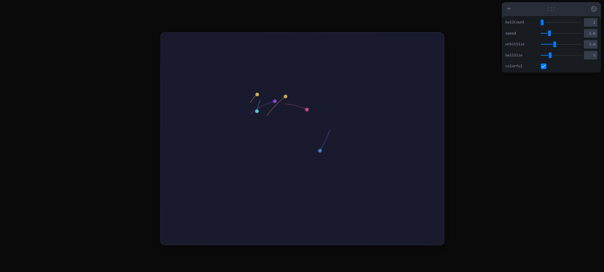

# Orbital Motion Balls

An orbital physics simulation built with React and Canvas, featuring planetary motion with variable speed dynamics.



## Features

- **Physics** - Variable orbital speed based on distance
- **3D Effects** - Fake effects for depth and perspective
- **Controls** - Using Leva adjustment

### Key Canvas Properties Used

- **`ctx.fillStyle`** - Ball colors and background rendering
- **`ctx.beginPath()`** - Start new drawing paths for balls
- **`ctx.arc()`** - Draw circular orbital balls
- **`ctx.quadraticCurveTo()`** - Smooth trail rendering 
- **`ctx.shadowBlur`** - Glowing effects

### Physics Implementation
**Orbital Mechanics:**
```javascript
// Variable Speed: Fast at center, slow at edges
const speedMultiplier = 2.0 - this.distanceFromCenter;
const currentAngularSpeed = this.baseAngularSpeed * speedMultiplier * params.speed;

// Sphere Orbits 
const currentRadius = this.baseOrbitRadius * (1 - this.eccentricity * Math.cos(this.angle));
const tiltedX = baseX * (1 + this.tiltZ * 0.3) + baseY * this.tiltX;
const tiltedY = baseY * (1 + this.tiltY) + baseX * this.tiltZ * 0.2;
```

### Controls
- **Ball Count** - Number of balls
- **Speed** - Ball velocity
- **Orbit Size** - Radius of orbital
- **Ball Size** - Ball size
- **Colorful** - For not only white balls


## Tech
- React 18
- Leva 
- Vite
